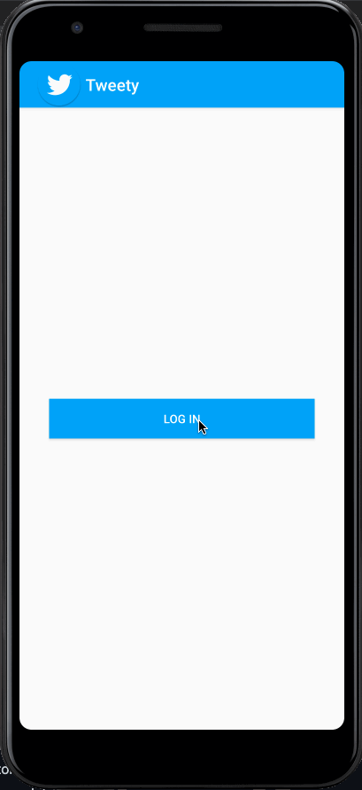

# Project - *Twitter Clone*

**Tweety** shows the latest tweets currently post in Twitter. The app utilizes the Twitter API to get and post information.

Submitted by: **Daniel Yamamoto**

Time spent: **17** hours spent in total

## User Stories

The following **required** functionality is completed:

* [x] User can **sign in** in to Twitter using OAuth login
* [x] User can view the tweets from their home timeline
* [x] For each tweet displayed, user can see the following details:
  * [x] Profile image
  * [x] User name
  * [x] Screen Name
  * [x] Date
  * [x] Image post if there is one
  * [x] Likes, Shares counts
* [x] User should be displayed the relative timestamp
* [x] User can **logout**
* [x] User can compose a new tweet
* [x] User can publish the compose the tweet and insert into list
* [x] User can pull to refresh
* [x] Allow user to view details of the movie including ratings within a separate activity

The following **stretch** features are implemented:

* [x] Improve the user interface and theme the app to feel "twitter branded" with colors and styles
  * [x] Use the png images
* [ ] User sees an indeterminate progress indicator
* [ ] User can "reply" to any tweet from their home timeline
  * [ ] The user that wrote the original tweet is automatically "@" replied in compose
* [x] User can click on a tweet to be taken to a "detail view" of that tweet
  * [ ] User can take favorite (and unfavorite) or reweet actions on a tweet
* [x] User can view more tweets as they scroll with Endless Scrolling
* [ ] Compose activity is replaced with a modal overlay
* [x] Links in tweets are clickable and will launch the web browser
* [x] Replace all icon drawables and other static image assets with vector drawables where appropriate
* [ ] User can view following / followers list through any profile they view
* [x] Apply the View Binding library to reduce view boilerplate
* [ ] Experiment with fancy scrolling effects on the Twitter profile view
* [ ] User can open the twitter app offline and see last loaded tweets persisted into SQLite

The following **additional** features are implemented:

* [ ] List anything else that you can get done to improve the app functionality!

## Video Walkthrough

Here's a walkthrough of implemented user stories:

GIF created with [Kap](https://getkap.co/).

## Notes

Describe any challenges encountered while building the app.

## Open-source libraries used

- [Android Async HTTP](https://github.com/loopj/android-async-http) - Simple asynchronous HTTP requests with JSON parsing
- [Glide](https://github.com/bumptech/glide) - Image loading and caching library for Android

## License

    Copyright 2021 Daniel Yamamoto

    Licensed under the Apache License, Version 2.0 (the "License");
    you may not use this file except in compliance with the License.
    You may obtain a copy of the License at

        http://www.apache.org/licenses/LICENSE-2.0

    Unless required by applicable law or agreed to in writing, software
    distributed under the License is distributed on an "AS IS" BASIS,
    WITHOUT WARRANTIES OR CONDITIONS OF ANY KIND, either express or implied.
    See the License for the specific language governing permissions and
    limitations under the License.